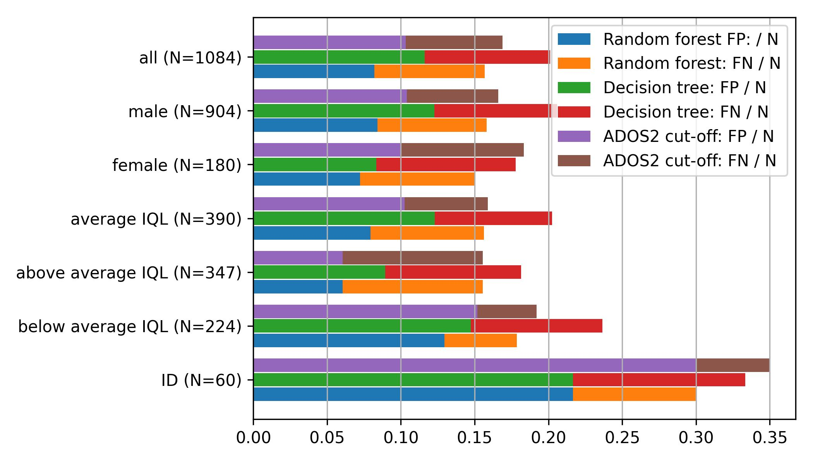
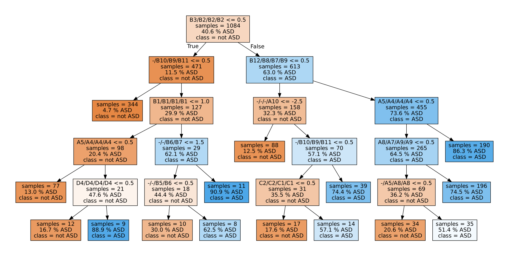
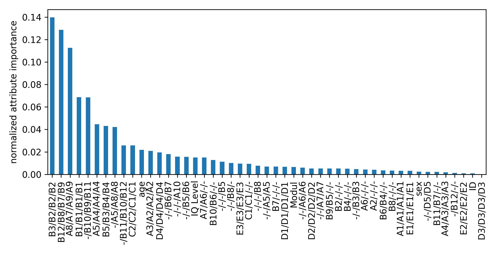

# Estimation of ASD-Diagnosis based on ADOS protocol
In this notebook, the presence of an Autism Spectrum Disorder (ASD)-diagnosis is estimated based on the ratings in the 
Autism Diagnostic Observation Schedule (ADOS). Main goal of this investigation was the comparison of the quality of one 
diagnostic instrument as well as Machine Learning approaches for cohorts with different IQ Levels. Furthermore, the 
importance of items of the ADOS w.r.t. the ASD-diagnosis are estimated.
The corresponding paper is available [here](https://doi.org/10.3389/fpsyt.2022.826043).

## Installation
The code was tested using `python3.8` and package versions as stated in requirements.txt.
Install via `pip install -r requirements.txt`. Other versions probably work as well.

## Data
Due to missing patients' consent, the data for reproducing the results presented in the paper must not be published.
For illustrating the structure of the data, sample data is provided.
Data from all modules are combined by associating items with corresponding meaning.
## Results
### Error Rates

### Item importance
#### Decision Tree

#### Random Forest

